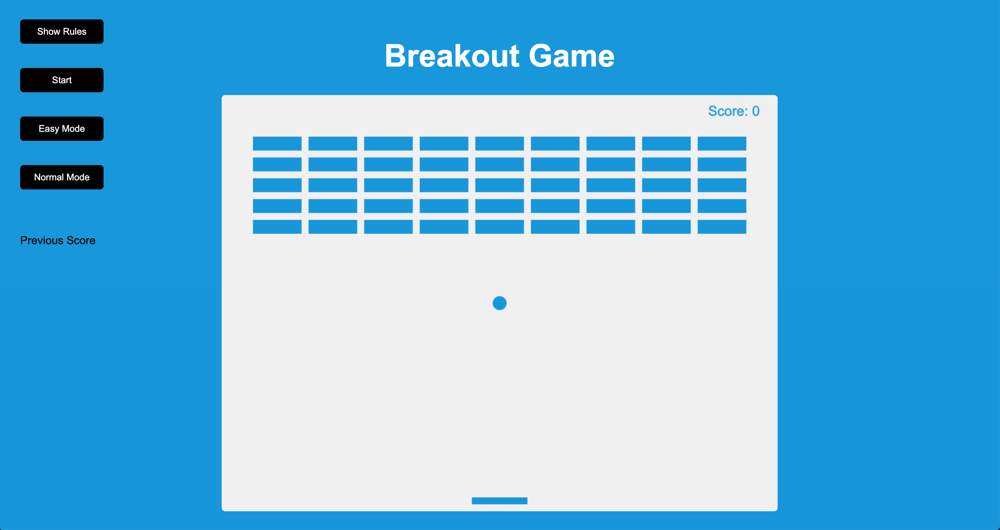

 # Breakout Game
 > Built with JavaScript, html5, css3. This app uses the HTML5 canvas element and API

[Go To This Project](https://kbingjie.com/breakout-game/)

 ## Customized Features
  - Added easy mode and normal mode instead of single mode
  - Added Start button
  - Added Previous Scores List
  - Added play again button
  - Added play again screen, it shows final score
  - Ball stops and goes off the edge after lose game
  - Canvas stay the last sceen after lose game
  - Stopped requestAnimationFrame() loop after lose game

## Original Features
 1. Create canvas context
 2. Create and draw ball
 3. Create and draw paddle
 4. Create bricks
 5. Draw score
 6. Add update() - Animate - requestAnimationFrame(cb)
 7. Move paddle
 8. Keyboard event handler to move paddle
 9. Move ball
 10. Add wall bounderies
 11. Increase score when brciks break
 12. Lose - redraw bricks, reset score
